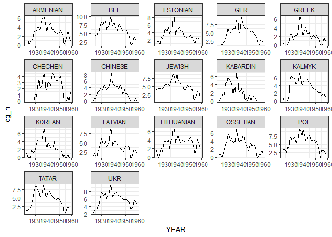

Geopolitics of repression
================
Martin Kosík
1 ledna 2019

Load the necessary packages

``` r
knitr::opts_chunk$set(echo = TRUE)
library(tidyverse)
```

    ## -- Attaching packages -------------------------------------------------------------------------------- tidyverse 1.2.1 --

    ## <U+221A> ggplot2 3.1.0     <U+221A> purrr   0.2.5
    ## <U+221A> tibble  1.4.2     <U+221A> dplyr   0.7.8
    ## <U+221A> tidyr   0.8.2     <U+221A> stringr 1.3.1
    ## <U+221A> readr   1.1.1     <U+221A> forcats 0.3.0

    ## -- Conflicts ----------------------------------------------------------------------------------- tidyverse_conflicts() --
    ## x dplyr::filter() masks stats::filter()
    ## x dplyr::lag()    masks stats::lag()

``` r
library(broom)
library(stargazer)
```

    ## 
    ## Please cite as:

    ##  Hlavac, Marek (2018). stargazer: Well-Formatted Regression and Summary Statistics Tables.

    ##  R package version 5.2.2. https://CRAN.R-project.org/package=stargazer

``` r
library(here)
```

    ## here() starts at C:/Users/Martin/Desktop/Thesis2/Geopolitics of repressions/Geopolitics-of-Repressions

Import the individual arrests data

``` r
load("data/eventsClean_v1.RData")
```

We checkout the names out all variables

``` r
names(events)

minorities_var_names <- names(events) %>% 
  str_subset("ETHNIC_")

minorities_var_names <- minorities_var_names[-1]
```

We count the number of arrests for each minority by year.

``` r
var_enq <- enquo(minorities_var_names)
min_by_year <- events %>%
  select(YEAR, ETHNIC_BEL:ETHNIC_CHECHEN) %>% 
  group_by_all() %>% 
  count() %>% 
  ungroup()
  
write_csv(min_by_year, "min_arrests_by_year.csv")
```

``` r
min_by_year <- read_csv(here("min_arrests_by_year.csv"))
```

    ## Parsed with column specification:
    ## cols(
    ##   YEAR = col_integer(),
    ##   ETHNIC_BEL = col_integer(),
    ##   ETHNIC_UKR = col_integer(),
    ##   ETHNIC_GER = col_integer(),
    ##   ETHNIC_POL = col_integer(),
    ##   ETHNIC_ARMENIAN = col_integer(),
    ##   ETHNIC_GREEK = col_integer(),
    ##   ETHNIC_JEWISH = col_integer(),
    ##   ETHNIC_KABARDIN = col_integer(),
    ##   ETHNIC_KALMYK = col_integer(),
    ##   ETHNIC_CHINESE = col_integer(),
    ##   ETHNIC_KOREAN = col_integer(),
    ##   ETHNIC_LATVIAN = col_integer(),
    ##   ETHNIC_LITHUANIAN = col_integer(),
    ##   ETHNIC_OSSETIAN = col_integer(),
    ##   ETHNIC_ESTONIAN = col_integer(),
    ##   ETHNIC_TATAR = col_integer(),
    ##   ETHNIC_CHECHEN = col_integer(),
    ##   n = col_integer()
    ## )

``` r
min_by_year <- min_by_year %>% 
  ungroup() %>% 
  mutate(n_of_eth_gr = rowSums(.[2:18])) %>% 
  filter(n_of_eth_gr == 1) %>% 
  select(-n_of_eth_gr) %>% 
  gather(key= "ethnicity", value = "value", -c(YEAR, n)) %>% 
  filter(value == 1) %>% 
  select(-value)

summary(min_by_year$ethnicity)
```

    ##    Length     Class      Mode 
    ##       665 character character

``` r
min_by_year <- min_by_year %>% 
  complete(YEAR, ethnicity, fill = list(n = 0)) %>% 
  filter(YEAR >= 1923) %>% 
  mutate(ethnicity = as.factor(str_remove(ethnicity, "ETHNIC_")),
         log_n = log(n + 1), 
         GER = ifelse(ethnicity == "GER", 1, 0))

years <- 1928:1936

post_year_dummies <- map_dfc(years, ~  as.numeric(min_by_year$YEAR >= .)) %>% 
  rename_all( funs( c(paste0("post_" ,years))))

min_by_year <-bind_cols(min_by_year, post_year_dummies)
```

We create the formula

``` r
fmla <- as.formula(paste("log_n ~ ", 
                         paste0("post_", years, ":GER", collapse = " + "),  "+ as.factor(YEAR) + ethnicity"))

summary(lm(fmla,  data = min_by_year))
```

    ## 
    ## Call:
    ## lm(formula = fmla, data = min_by_year)
    ## 
    ## Residuals:
    ##     Min      1Q  Median      3Q     Max 
    ## -2.7945 -0.5769 -0.0192  0.4555  3.2178 
    ## 
    ## Coefficients:
    ##                      Estimate Std. Error t value Pr(>|t|)    
    ## (Intercept)          0.804885   0.260592   3.089 0.002109 ** 
    ## as.factor(YEAR)1924 -0.041058   0.306765  -0.134 0.893574    
    ## as.factor(YEAR)1925 -0.152742   0.306765  -0.498 0.618738    
    ## as.factor(YEAR)1926  0.021603   0.306765   0.070 0.943881    
    ## as.factor(YEAR)1927  0.844604   0.306765   2.753 0.006090 ** 
    ## as.factor(YEAR)1928  1.323214   0.312464   4.235 2.67e-05 ***
    ## as.factor(YEAR)1929  2.756899   0.312464   8.823  < 2e-16 ***
    ## as.factor(YEAR)1930  3.659664   0.312464  11.712  < 2e-16 ***
    ## as.factor(YEAR)1931  3.406684   0.312464  10.903  < 2e-16 ***
    ## as.factor(YEAR)1932  3.402924   0.312464  10.891  < 2e-16 ***
    ## as.factor(YEAR)1933  3.720303   0.312464  11.906  < 2e-16 ***
    ## as.factor(YEAR)1934  2.325665   0.312464   7.443 3.67e-13 ***
    ## as.factor(YEAR)1935  3.126596   0.312464  10.006  < 2e-16 ***
    ## as.factor(YEAR)1936  3.374248   0.307921  10.958  < 2e-16 ***
    ## as.factor(YEAR)1937  5.938612   0.307921  19.286  < 2e-16 ***
    ## as.factor(YEAR)1938  5.733053   0.307921  18.619  < 2e-16 ***
    ## as.factor(YEAR)1939  2.914036   0.307921   9.464  < 2e-16 ***
    ## as.factor(YEAR)1940  3.396438   0.307921  11.030  < 2e-16 ***
    ## as.factor(YEAR)1941  3.924087   0.307921  12.744  < 2e-16 ***
    ## as.factor(YEAR)1942  3.558161   0.307921  11.555  < 2e-16 ***
    ## as.factor(YEAR)1943  3.225760   0.307921  10.476  < 2e-16 ***
    ## as.factor(YEAR)1944  2.953525   0.307921   9.592  < 2e-16 ***
    ## as.factor(YEAR)1945  2.951384   0.307921   9.585  < 2e-16 ***
    ## as.factor(YEAR)1946  2.482057   0.307921   8.061 4.52e-15 ***
    ## as.factor(YEAR)1947  1.924895   0.307921   6.251 8.01e-10 ***
    ## as.factor(YEAR)1948  2.025274   0.307921   6.577 1.09e-10 ***
    ## as.factor(YEAR)1949  2.152503   0.307921   6.990 7.73e-12 ***
    ## as.factor(YEAR)1950  2.082018   0.307921   6.762 3.40e-11 ***
    ## as.factor(YEAR)1951  2.254345   0.307921   7.321 8.47e-13 ***
    ## as.factor(YEAR)1952  1.573150   0.307921   5.109 4.43e-07 ***
    ## as.factor(YEAR)1953  1.134701   0.307921   3.685 0.000251 ***
    ## as.factor(YEAR)1954 -0.492442   0.307921  -1.599 0.110323    
    ## as.factor(YEAR)1955 -0.568116   0.307921  -1.845 0.065558 .  
    ## as.factor(YEAR)1956 -0.069720   0.307921  -0.226 0.820955    
    ## as.factor(YEAR)1957  0.827731   0.307921   2.688 0.007397 ** 
    ## as.factor(YEAR)1958  0.442001   0.307921   1.435 0.151715    
    ## as.factor(YEAR)1959 -0.065765   0.307921  -0.214 0.830953    
    ## ethnicityBEL         3.006210   0.207936  14.457  < 2e-16 ***
    ## ethnicityESTONIAN    0.580277   0.207936   2.791 0.005437 ** 
    ## ethnicityGER         1.004450   0.436170   2.303 0.021646 *  
    ## ethnicityGREEK      -0.966715   0.207936  -4.649 4.15e-06 ***
    ## ethnicityCHECHEN    -0.952913   0.207936  -4.583 5.65e-06 ***
    ## ethnicityCHINESE    -0.009235   0.207936  -0.044 0.964590    
    ## ethnicityJEWISH      2.088166   0.207936  10.042  < 2e-16 ***
    ## ethnicityKABARDIN   -0.963904   0.207936  -4.636 4.42e-06 ***
    ## ethnicityKALMYK      0.527377   0.207936   2.536 0.011472 *  
    ## ethnicityKOREAN     -0.729293   0.207936  -3.507 0.000489 ***
    ## ethnicityLATVIAN     0.908060   0.207936   4.367 1.50e-05 ***
    ## ethnicityLITHUANIAN  0.349522   0.207936   1.681 0.093331 .  
    ## ethnicityOSSETIAN    0.012807   0.207936   0.062 0.950909    
    ## ethnicityPOL         2.571326   0.207936  12.366  < 2e-16 ***
    ## ethnicityTATAR       1.728383   0.207936   8.312 6.98e-16 ***
    ## ethnicityUKR         2.971215   0.207936  14.289  < 2e-16 ***
    ## post_1928:GER        0.268648   1.009881   0.266 0.790321    
    ## GER:post_1929        0.077772   1.303750   0.060 0.952453    
    ## GER:post_1930        0.722720   1.303750   0.554 0.579565    
    ## GER:post_1931       -0.847081   1.303750  -0.650 0.516132    
    ## GER:post_1932       -0.507066   1.303750  -0.389 0.697475    
    ## GER:post_1933        0.296631   1.303750   0.228 0.820100    
    ## GER:post_1934        1.971472   1.303750   1.512 0.131052    
    ## GER:post_1935       -0.706422   1.303750  -0.542 0.588143    
    ## GER:post_1936        0.019202   0.940901   0.020 0.983725    
    ## ---
    ## Signif. codes:  0 '***' 0.001 '**' 0.01 '*' 0.05 '.' 0.1 ' ' 1
    ## 
    ## Residual standard error: 0.8944 on 567 degrees of freedom
    ## Multiple R-squared:  0.8627, Adjusted R-squared:  0.8479 
    ## F-statistic: 58.41 on 61 and 567 DF,  p-value: < 2.2e-16

``` r
fmla_simple <- as.formula(paste("log_n ~ ", 
                         paste0("post_", years, ":GER", collapse = " + "),  "+ as.factor(YEAR) + GER"))

summary(lm(fmla_simple,  data = min_by_year))
```

    ## 
    ## Call:
    ## lm(formula = fmla_simple, data = min_by_year)
    ## 
    ## Residuals:
    ##     Min      1Q  Median      3Q     Max 
    ## -4.4535 -1.0306 -0.1237  1.0507  4.5003 
    ## 
    ## Coefficients:
    ##                     Estimate Std. Error t value Pr(>|t|)    
    ## (Intercept)          1.49997    0.39505   3.797 0.000162 ***
    ## as.factor(YEAR)1924 -0.04106    0.55523  -0.074 0.941077    
    ## as.factor(YEAR)1925 -0.15274    0.55523  -0.275 0.783339    
    ## as.factor(YEAR)1926  0.02160    0.55523   0.039 0.968976    
    ## as.factor(YEAR)1927  0.84460    0.55523   1.521 0.128758    
    ## as.factor(YEAR)1928  1.32321    0.56554   2.340 0.019635 *  
    ## as.factor(YEAR)1929  2.75690    0.56554   4.875 1.41e-06 ***
    ## as.factor(YEAR)1930  3.65966    0.56554   6.471 2.07e-10 ***
    ## as.factor(YEAR)1931  3.40668    0.56554   6.024 3.02e-09 ***
    ## as.factor(YEAR)1932  3.40292    0.56554   6.017 3.14e-09 ***
    ## as.factor(YEAR)1933  3.72030    0.56554   6.578 1.06e-10 ***
    ## as.factor(YEAR)1934  2.32567    0.56554   4.112 4.48e-05 ***
    ## as.factor(YEAR)1935  3.12660    0.56554   5.528 4.88e-08 ***
    ## as.factor(YEAR)1936  3.37425    0.55732   6.054 2.53e-09 ***
    ## as.factor(YEAR)1937  5.93861    0.55732  10.656  < 2e-16 ***
    ## as.factor(YEAR)1938  5.73305    0.55732  10.287  < 2e-16 ***
    ## as.factor(YEAR)1939  2.91404    0.55732   5.229 2.38e-07 ***
    ## as.factor(YEAR)1940  3.39644    0.55732   6.094 2.00e-09 ***
    ## as.factor(YEAR)1941  3.92409    0.55732   7.041 5.40e-12 ***
    ## as.factor(YEAR)1942  3.55816    0.55732   6.384 3.52e-10 ***
    ## as.factor(YEAR)1943  3.22576    0.55732   5.788 1.17e-08 ***
    ## as.factor(YEAR)1944  2.95353    0.55732   5.299 1.65e-07 ***
    ## as.factor(YEAR)1945  2.95138    0.55732   5.296 1.68e-07 ***
    ## as.factor(YEAR)1946  2.48206    0.55732   4.454 1.01e-05 ***
    ## as.factor(YEAR)1947  1.92489    0.55732   3.454 0.000593 ***
    ## as.factor(YEAR)1948  2.02527    0.55732   3.634 0.000304 ***
    ## as.factor(YEAR)1949  2.15250    0.55732   3.862 0.000125 ***
    ## as.factor(YEAR)1950  2.08202    0.55732   3.736 0.000206 ***
    ## as.factor(YEAR)1951  2.25435    0.55732   4.045 5.94e-05 ***
    ## as.factor(YEAR)1952  1.57315    0.55732   2.823 0.004925 ** 
    ## as.factor(YEAR)1953  1.13470    0.55732   2.036 0.042204 *  
    ## as.factor(YEAR)1954 -0.49244    0.55732  -0.884 0.377285    
    ## as.factor(YEAR)1955 -0.56812    0.55732  -1.019 0.308452    
    ## as.factor(YEAR)1956 -0.06972    0.55732  -0.125 0.900489    
    ## as.factor(YEAR)1957  0.82773    0.55732   1.485 0.138034    
    ## as.factor(YEAR)1958  0.44200    0.55732   0.793 0.428055    
    ## as.factor(YEAR)1959 -0.06577    0.55732  -0.118 0.906107    
    ## GER                  0.30937    0.74621   0.415 0.678596    
    ## post_1928:GER        0.26865    1.82784   0.147 0.883202    
    ## GER:post_1929        0.07777    2.35973   0.033 0.973719    
    ## GER:post_1930        0.72272    2.35973   0.306 0.759506    
    ## GER:post_1931       -0.84708    2.35973  -0.359 0.719744    
    ## GER:post_1932       -0.50707    2.35973  -0.215 0.829934    
    ## GER:post_1933        0.29663    2.35973   0.126 0.900008    
    ## GER:post_1934        1.97147    2.35973   0.835 0.403798    
    ## GER:post_1935       -0.70642    2.35973  -0.299 0.764768    
    ## GER:post_1936        0.01920    1.70299   0.011 0.991008    
    ## ---
    ## Signif. codes:  0 '***' 0.001 '**' 0.01 '*' 0.05 '.' 0.1 ' ' 1
    ## 
    ## Residual standard error: 1.619 on 582 degrees of freedom
    ## Multiple R-squared:  0.5383, Adjusted R-squared:  0.5019 
    ## F-statistic: 14.75 on 46 and 582 DF,  p-value: < 2.2e-16

``` r
min_by_year %>% 
  ggplot(aes(x = YEAR, y = log_n)) + geom_line() + facet_wrap(~ethnicity, scales = "free") + theme_bw()
```


